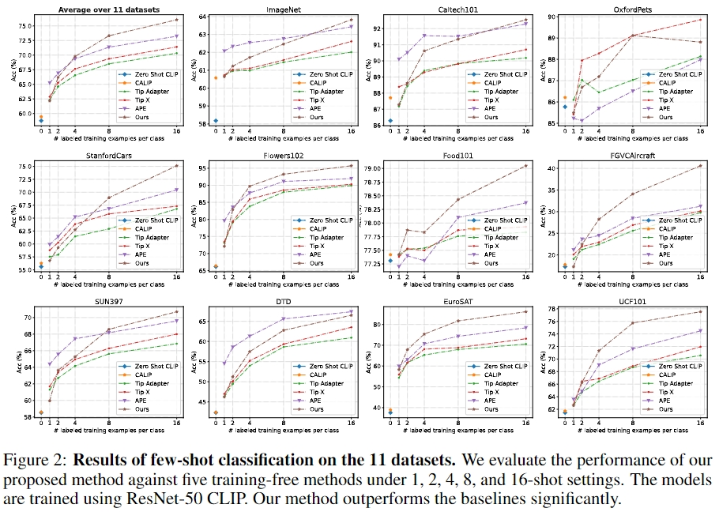
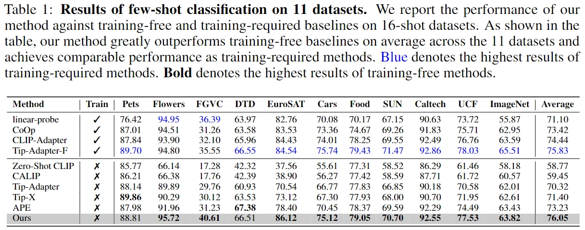
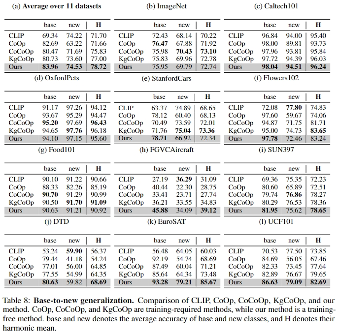
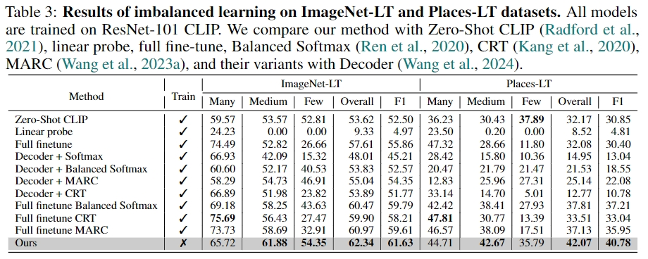
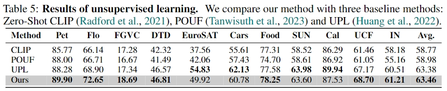

<!-- 
 -->

  

    <h2 class="title is-3">Abstract</h2>
    

Contrastive Language-Image Pretraining (CLIP) has gained popularity for its remarkable zero-shot capacity. Recent research has focused on developing efficient fine-tuning methods, such as prompt learning and adapter, to enhance CLIP's performance in downstream tasks. However, these methods still require additional training time and computational resources, which is undesirable for devices with limited resources. In this paper, we revisit a classical algorithm, Gaussian Discriminant Analysis (GDA), and apply it to the downstream classification of CLIP. Typically, GDA assumes that features of each class follow Gaussian distributions with identical covariance. By leveraging Bayes' formula, the classifier can be expressed in terms of the class means and covariance, which can be estimated from the data without the need for training. To integrate knowledge from both visual and textual modalities, we ensemble it with the original zero-shot classifier within CLIP. Extensive results on 17 datasets validate that our method surpasses or achieves comparable results with state-of-the-art methods on few-shot classification, imbalanced learning, and out-of-distribution generalization. In addition, we extend our method to base-to-new generalization and unsupervised learning, once again demonstrating its superiority over competing approaches. Our code is publicly available at <a href="https://github.com/mrflogs/ICLR24">https://github.com/mrflogs/ICLR24</a>.
        

    

  

    <h2 class="title is-3">Method Overview</h2>
      

        
      

      <figcaption> 

          Figure 1. 
          <strong>The overview of our training-free method.</strong>
          In our method, we begin by extracting visual features from the training dataset using the CLIP visual encoder. 
          Next, we compute the mean vectors for each class and the shared precision matrix (inverse covariance) using Eq.(\ref{eq:precisionmatrix}).
          Through the Gaussian Discriminate Analysis (GDA), the weight and bias of the classifier can be expressed in terms of the mean vectors and the precision matrix, which can be derived from Eq.(\ref{eq:solution}) 
          (the red formula in the figure.) 
          Finally, we enhance our method by ensembling the GDA classifier and the CLIP's zero-shot classifier, integrating the knowledge from visual and textual modalities.
      

      </figcaption>
      <h3 class="title is-4">TL;DR</h3>
      

        

        In this paper, we've revisited Gaussian Discriminate Analysis (GDA) within CLIP and found that it stands out as a hard-to-beat training-free baseline for CLIP-based adaptation, which surpasses previous state-of-the-art training-based and traing-free fine-tuning methods, thanks to its covariance assumption.
        Moreover,  we have expanded its application to include CLIP long-tail classification, base-to-new generalization, and unsupervised learning, showcasing its broad effectiveness.
        

      

      <h3 class="title is-4">Basic Setting</h3>
      

        

        Gaussian Dicriminate Analysis (GDA) is a well-known probability discriminative method in machine learning. 
        Without explicit learning such as gradient descent, GDA obtains the classifier by estimating the mean vectors and the covariance matrix of the data. 
        By utilizing the Bayes Formula, we can obtain the classification weights as follows:
        

      

      

      \[
      \begin{equation}
        \label{eq:solution}
        w_i = \Sigma^{-1}\mu_i, \quad
        b_i = \log p_i - \frac{1}{2}\mu_i^T\Sigma^{-1}\mu_i, \tag{1}
      \end{equation}
      \]
      

      

      \[
      \begin{equation}
      \label{eq:precisionmatrix}
        \widehat{\Sigma^{-1}} = D((N-1)\hat{\Sigma} + tr(\hat{\Sigma})I_D)^{-1}, \tag{2}
      \end{equation}
      \]
      

      

      

      We can further ensemble GDA with the CLIP zero-shot classifier.
      

      

      

      \[
      \begin{equation}
        \label{eq:ensemble}
        logits = x_{test}W_c^T + \alpha (x_{test}W^T + b), \tag{3}
      \end{equation}
      \]
      

      

      

      We apply this formula in CLIP few-shot classification and long-tailed classification. 
      

      

      <h3 class="title is-4">Extention to more scenarios</h3>
      <h4 class="title is-5">Base-to-New Generalization</h4>
      

      For CLIP base-to-new generalization, the model is trained on the base dataset and tested on a new dataset with unseen classes.
      However, our method cannot be directly implemented in the scenario where data for the new classes is unavailable.
      Based on the observation that similar samples have similar statistical information, we propose that our method can be extended to new classes using the KNN algorithm.
      To achieve this, we utilize text embeddings of the new classes to query the training set and select the k nearest neighbors as the synthesized labeled data. 
The process is defined as follows:
      

      

      \[  
      \begin{equation}
        \tilde{\mathcal{D}}_{new} = \bigcup_{i=K+1}^M\{(x, i)|x\in NN^k(t_i, \mathcal{D})\}, \tag{4}
      \end{equation}
      \]
      

      <h4 class="title is-5">Unsupervised Learning</h4>
      

      In the unsupervised learning scenario, we only have the unlabeled data \(\{x_i\}_{i=1}^N\).
      Based on the Gaussian assumption in GDA, the unsupervised data \(\{x_i\}_{i=1}^N\) follow Gaussian mixture distribution.
      In order to maintain the simplicity of our method, we directly employ the EM algorithm for estimating the means and covariance matrix.
      To begin, we initialize the mean vectors and covariance using the zero-shot classifier, assuming equal priors for each Gaussian distribution.
      In the E-step, we calculate the probability of the unlabeled data \(\{x_i\}_{i=1}^N\) as follows:
      

      

      \[
      \begin{equation}
        \gamma_{ik} = \frac{\exp(f_k(x))}{\Sigma_{j=1}^K\exp{(f_j(x_i))}}, \tag{5}
      \end{equation}
      \]
      

      

      for the unlabeled data \(\{x_i\}_{i=1}^N\), and \(f\) is the logit function using Eq.(\ref{eq:ensemble}).
      Moving on to the M-step, we update the mean vectors and covariance matrix using the following formulas:
      

      

      \[
      \begin{equation}
        \mu_k = \frac{\sum_{i=1}^N\gamma_{ik}x_i}{\sum_{i=1}^N\gamma_{ik}}, \quad
        \Sigma =\frac{1}{K}\sum_{k=1}^K\frac{\sum_{i=1}^N\gamma_{ik}(x_i - \mu_k)(x_i - \mu_k)^T}{\sum_{i=1}^N\gamma_{ik}}. \tag{6}
      \end{equation}
      \]
      

      

      

      Subsequently, we update the classifier using Eq.(\ref{eq:solution}) and repeat the EM process until convergence.
      

      

    <h2 class="title is-3">Experiments</h2>
    <h3 class="title is-4">Few-shot Classification</h3>
    

      
    

    

      
    

    <h3 class="title is-4">Base-to-New Generalization</h3>
    

      
    

    <h3 class="title is-4">Long-tailed Classification</h3>
    

      
    

    <h3 class="title is-4">Unsupervised Learning</h3>
    

      
    

  

<section class="section" id="BibTeX">
  

    <h2 class="title">BibTeX</h2>
    <pre><code>@article{wang2024baseline,
  author    = {Wang, Zhengbo and Liang, Jian and Sheng, Lijun and He, Ran and Wang, Zilei and Tan, Tieniu},
  title     = {A Hard-to-Beat Baseline for Training-free CLIP-based Adaptation},
  journal   = {The Twelfth International Conference on Learning Representations (ICLR)},
  year      = {2024},
}</code></pre>
  

</section>
